# Design Documentation

This document provides both High-Level Design (HLD) and Low-Level Design (LLD) for the Course Enrollment System.

---

## Table of Contents

1. [High-Level Design](#high-level-design)
2. [Low-Level Design](#low-level-design)
3. [System Architecture](#system-architecture)
4. [Data Flow](#data-flow)

---

## High-Level Design

### Problem Context

The system manages colleges, students, courses, and course timetables, ensuring students can enroll in courses without timetable conflicts. Key requirements:

- Students can only enroll in courses from their own college
- Timetable clashes are prevented during enrollment
- Admin can manage timetables without breaking existing enrollments

### Architectural Style

- **Modular Monolith**: Domain-driven module separation
- **Layered Architecture**: Controllers → Services → Repositories → Database
- **Centralized Database**: Single PostgreSQL database with proper constraints
- **Business Logic**: Enforced at service layer with database-level validation

### Functional Requirements

#### Core Requirements

1. **FR1**: Support onboarding of multiple colleges
2. **FR2**: Maintain students associated with a college
3. **FR3**: Maintain courses offered by a college
4. **FR4**: Maintain multiple timetable slots per course
5. **FR5**: Allow students to enroll in courses
6. **FR6**: Prevent enrollment in courses with timetable clashes
7. **FR7**: Ensure students can enroll only in courses from their own college

#### Admin Requirements

8. **FR8**: Admin can add, update, or delete course timetables
9. **FR9**: Timetable changes must not cause conflicts for already enrolled students

### Non-Functional Requirements

1. **NFR1**: Strong data consistency
2. **NFR2**: Atomic enrollment operations
3. **NFR3**: Low latency during enrollment validation
4. **NFR4**: Horizontal scalability across colleges
5. **NFR5**: High maintainability and testability
6. **NFR6**: Protection against race conditions

### High-Level Components

```
┌─────────────────────────────────────────────────────────┐
│                    API Layer (Controllers)              │
│  - RESTful endpoints                                    │
│  - Request/Response handling                            │
└──────────────────┬──────────────────────────────────────┘
                   │
┌──────────────────▼──────────────────────────────────────┐
│                 Service Layer                            │
│  - Business logic                                        │
│  - Validation                                            │
│  - Transaction management                                │
└──────────────────┬──────────────────────────────────────┘
                   │
┌──────────────────▼──────────────────────────────────────┐
│              Repository/ORM Layer                        │
│  - TypeORM entities                                      │
│  - Database abstraction                                 │
└──────────────────┬──────────────────────────────────────┘
                   │
┌──────────────────▼──────────────────────────────────────┐
│              PostgreSQL Database                         │
│  - Tables with constraints                              │
│  - Foreign keys                                          │
│  - Indexes                                              │
└─────────────────────────────────────────────────────────┘
```

### Component Interaction Flow

**Enrollment Flow:**
```
Client Request
    ↓
Controller (EnrollmentController)
    ↓
Service (EnrollmentService)
    ├─→ Validate Student
    ├─→ Validate Courses
    ├─→ Check College Match
    ├─→ Check Timetable Conflicts
    └─→ Save Enrollments (Transaction)
    ↓
Database (PostgreSQL)
```

---

## Low-Level Design

### Database Schema

#### Entity Relationship Diagram
[](./erd-schema.svg)

### Domain Models

#### College
```typescript
{
  id: number;           // Primary Key, Auto-increment
  name: string;          // Unique
}
```

#### Student
```typescript
{
  id: number;           // Primary Key, Auto-increment
  name: string;
  college_id: number;   // Foreign Key → colleges.id
}
```

#### Course
```typescript
{
  id: number;           // Primary Key, Auto-increment
  code: string;
  college_id: number;   // Foreign Key → colleges.id
}
```

#### Semester
```typescript
{
  id: number;           // Primary Key, Auto-increment
  name: string;
  start_date: Date;     // Date type
  end_date: Date;       // Date type
}
```

#### CourseTimetable
```typescript
{
  id: number;           // Primary Key, Auto-increment
  course_id: number;    // Foreign Key → courses.id
  day_of_week: string; // e.g., "Monday", "Tuesday"
  start_time: Time;     // Time type (HH:mm)
  end_time: Time;       // Time type (HH:mm)
}
```

#### Enrollment
```typescript
{
  id: number;           // Primary Key, Auto-increment
  student_id: number;  // Foreign Key → students.id
  course_id: number;    // Foreign Key → courses.id
  semester_id: number;  // Foreign Key → semesters.id
  enrolled_at: Date;    // Timestamp, Default: CURRENT_TIMESTAMP
}
```

### Service Layer Design

#### EnrollmentService

**Responsibilities:**
- Validate student existence
- Validate course existence
- Enforce same-college rule
- Detect timetable clashes
- Persist enrollment atomically

**Key Methods:**
```typescript
enrollStudent(
  studentId: number,
  courseIds: number[],
  semesterId: number
): Promise<Enrollment[]>

findByStudent(
  studentId: number,
  semesterId?: number
): Promise<Enrollment[]>
```

**Enrollment Algorithm:**
1. Validate student exists
2. Fetch student's college
3. Validate all courses exist
4. Check all courses belong to student's college
5. Fetch all timetables for selected courses
6. Check for timetable conflicts:
   - Same day of week
   - Overlapping time slots
7. If valid, save enrollments in transaction
8. Return created enrollments

#### TimetableService

**Responsibilities:**
- Manage course timetable slots
- Ensure safe updates for enrolled students

**Key Methods:**
```typescript
addTimetable(
  courseId: number,
  dayOfWeek: string,
  startTime: string,
  endTime: string
): Promise<Timetable>

updateTimetable(
  timetableId: number,
  dayOfWeek: string,
  startTime: string,
  endTime: string
): Promise<Timetable>

deleteTimetable(timetableId: number): Promise<void>
```

### Module Structure

The project follows a **domain-driven design** with modular monolith architecture:

```
src/
├── app.module.ts              # Root module
├── main.ts                    # Application entry point
├── app.controller.ts          # Root controller
├── app.service.ts             # Root service
├── common/                    # Shared utilities
│   ├── database/
│   │   ├── database.module.ts
│   │   ├── typeorm.config.ts
│   │   └── migrations/       # TypeORM migration files
│   ├── decorators/            # Custom decorators
│   ├── exceptions/            # Custom exception handlers
│   └── utils/                 # Utility functions
├── colleges/                  # College domain module
│   ├── college.module.ts
│   ├── college.controller.ts
│   ├── college.service.ts
│   └── entities/
│       └── college.entity.ts
├── students/                  # Student domain module
│   ├── student.module.ts
│   ├── student.controller.ts
│   ├── student.service.ts
│   └── entities/
│       └── student.entity.ts
├── courses/                  # Course domain module
│   ├── course.module.ts
│   ├── course.controller.ts
│   ├── course.service.ts
│   └── entities/
│       └── course.entity.ts
├── semesters/                 # Semester domain module
│   ├── semester.module.ts
│   ├── semester.controller.ts
│   ├── semester.service.ts
│   └── entities/
│       └── semester.entity.ts
├── timetables/                # Timetable domain module
│   ├── timetable.module.ts
│   ├── timetable.controller.ts
│   ├── timetable.service.ts
│   └── entities/
│       └── timetable.entity.ts
└── enrollments/               # Enrollment domain module
    ├── enrollment.module.ts
    ├── enrollment.controller.ts
    ├── enrollment.service.ts
    └── entities/
        └── enrollment.entity.ts
```

**Structure Principles:**
- Each domain has its own module with controller, service, and entities
- Common utilities are shared in the `common/` folder
- Entities are separated into their own folder within each domain
- Follows NestJS best practices for modular architecture

### Design Patterns

The system implements several design patterns:

1. **Repository Pattern**
   - TypeORM repositories abstract database access
   - Provides a clean interface for data persistence
   - Enables easy testing and database switching

2. **Service Layer Pattern**
   - Business logic centralized in services
   - Controllers are thin and delegate to services
   - Services handle validation, conflict detection, and transactions

3. **Transaction Script Pattern**
   - Enrollment operations wrapped in database transactions
   - Ensures atomicity and data consistency
   - Prevents partial enrollments on failures

4. **Module Pattern**
   - Domain-driven module separation
   - Each module is self-contained with its own dependencies
   - Enables better code organization and maintainability

5. **Strategy Pattern (Future Enhancement)**
   - Timetable conflict detection logic can be extended
   - Different conflict detection strategies per semester or format
   - Allows for flexible business rule implementation

### Constraints and Validations

#### Database Constraints

1. **Foreign Keys**: All foreign keys use `ON DELETE CASCADE`
2. **Unique Constraints**:
   - College names must be unique
   - Student cannot enroll in same course in same semester twice
3. **Indexes**: Created on foreign key columns for performance

#### Application-Level Validations

1. **Student Validation**: Student must exist
2. **Course Validation**: All courses must exist
3. **College Match**: Student and courses must belong to same college
4. **Timetable Conflict**: No overlapping time slots on same day

### Design Guarantees

✅ All functional requirements satisfied  
✅ Timetable clashes prevented at service and database level  
✅ College isolation enforced  
✅ Enrollment operations are atomic  
✅ Admin timetable changes are safe  
✅ System is extensible and maintainable  

---

## System Architecture

### Technology Stack

- **Framework**: NestJS (Node.js)
- **Database**: PostgreSQL
- **ORM**: TypeORM
- **Language**: TypeScript

### Deployment Architecture

```
┌─────────────────┐
│   Load Balancer │
└────────┬────────┘
         │
    ┌────▼────┐
    │ NestJS  │
    │  App    │
    └────┬────┘
         │
    ┌────▼────┐
    │PostgreSQL│
    │ Database │
    └─────────┘
```

---

## Data Flow

### Enrollment Request Flow

```
1. Client sends POST /enrollments
   {
     "studentId": 1,
     "courseIds": [1, 2, 3],
     "semesterId": 1
   }

2. Controller receives request
   → EnrollmentController.enroll()

3. Service validates:
   → EnrollmentService.enrollStudent()
   ├─ Validate student exists
   ├─ Validate courses exist
   ├─ Check college match
   └─ Check timetable conflicts

4. If valid, transaction begins:
   → Save enrollment records
   → Commit transaction

5. Return success response with enrollments

6. If invalid, return error response
```

### Timetable Conflict Detection

```
For each pair of timetables (i, j):
  If timetables[i].day_of_week == timetables[j].day_of_week:
    If NOT (timetables[i].end_time <= timetables[j].start_time OR
            timetables[j].end_time <= timetables[i].start_time):
      → Conflict detected
      → Throw BadRequestException
```

---

## Summary

This design provides:

- **Scalability**: Modular architecture allows horizontal scaling
- **Maintainability**: Clear separation of concerns
- **Reliability**: Database constraints ensure data integrity
- **Performance**: Indexes optimize query performance
- **Extensibility**: Easy to add new features (e.g., waitlists, capacity limits)

For detailed database schema, see [Database Schema](./database-schema.md).

